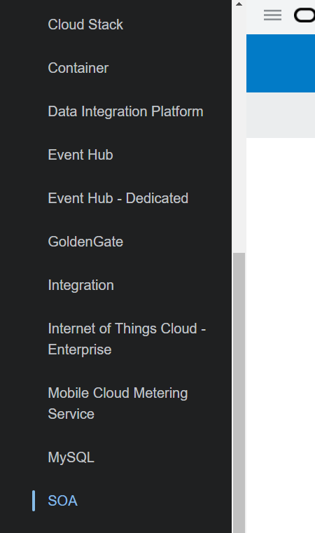
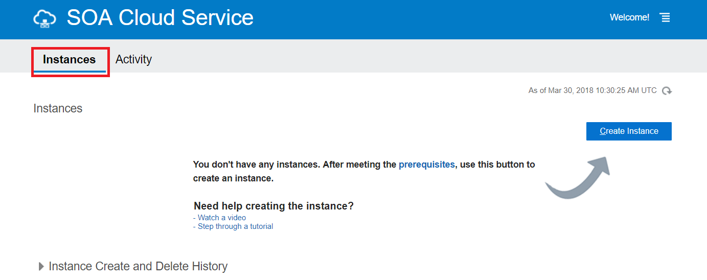
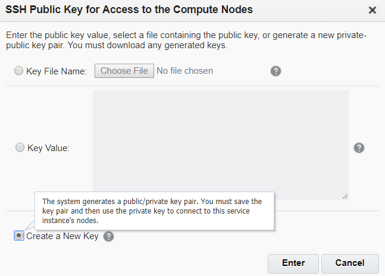
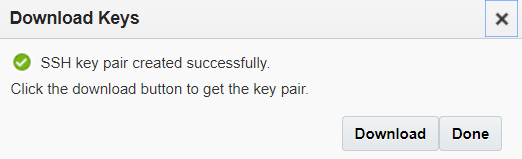
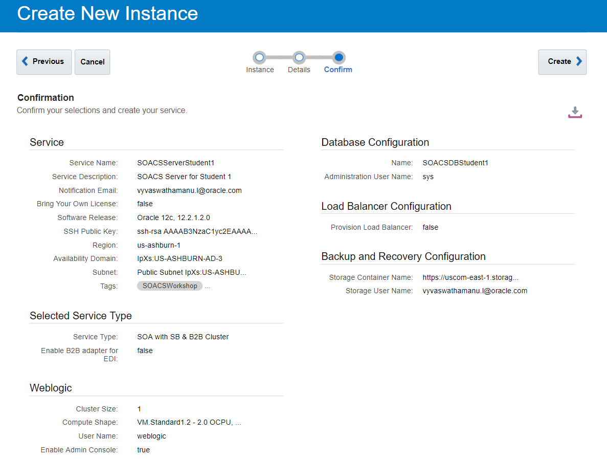
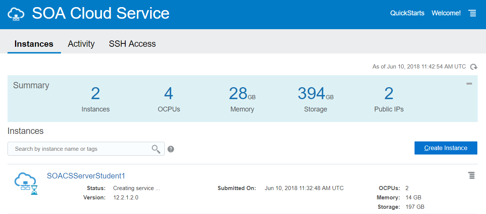

# Lab 100 - Provision Oracle SOA Cloud Service

---

# Objectives

- In this activity, you provision your Oracle SOA Cloud Service Instance.

## Required Artifacts

- Your Oracle Cloud Infrastructure user name and password.

If you don't have the user name, password, and web console URL, contact your organization's Oracle Cloud administrator who subscribed to Oracle Cloud Infrastructure.

# Creating and Provisionig a SOACS Instance

- Open a browser window and go to Oracle Cloud My Services:
***https://myservices.DC_code.oraclecloud.com***

- Sign in to your Services Console using your identity domain, user name and password.

- In the Oracle Cloud My Services page, click the menu icon on the left and then choose the **SOA** link under Services.

    

- On the Oracle SOA Cloud Service page, under Instances tab, click **Create Instance**.

    

### Providing Basic Service Instance Information

Enter the basic information for your instance.

**Service Name:** SOACSServerStudent`X`
where `X` is the student number alloted to you (1,2,3,....)

**Service Description:** Optionally describe the service instance.

**Region:** us-ashburn-1

**Availability Domain:** oscnas152599 | oscnas152599VCN | Public Subnet IpXs:US-ASHBURN-AD-3

**Subnet:** IpXs:US-ASHBURN-AD-3

**Tags:** `SOACSWorkshop` and optionally your name

**SSH Public Key:** Click **Edit**. Select **Create a New Key**. Click **Enter**.

Click **Download** and Click **Done** after the keys get downloaded. You will not be able to proceed without downloading the keys.

**Software Release:** Oracle 12c 12.2.1.2.0

Click **Next** to specify **Service Details**.

### Specifying Service Details

Select the various details required for your service instance.

#### Select Service Type

**Service Type:** SOA with SB and B2B

#### Weblogic

**Compute Shape:** VM.Standard1.2 - 2.0 OCPU, 14.0GB RAM

**Username:** weblogic

**Password:** Alpha2018_

**Confirm Password:** Alpha2018_

**Enable Admin Console:** Checked

#### Database Configuration

**Name:** SOACSDBStudent`X`
where `X` is the student number alloted to you (1,2,3,....)

***Note:*** The DBCS instances are pre-provisioned for the labs per student number (1,2,3,....)

**Administration User Name:** SYS

**Password:** Alpha2018_

#### Backup and Recovery Configuration

**Storage Container Name:** 
Specify the name of the container in this format: `https|http://<storagedomain>/{version}/<schema name>/<container name> or <storage service name>-<identity domain name>/<container name>`.

For example, **https://uscom-east-1.storage.oraclecloud.com/v1/Storage-oscnas001/mySOACSServerStudentXBucket**, where uscom-east-1 is the name of your identity domain and mySOACSServerStudent`X` Bucket is the name of the container that you want to create/created for service instance backups with `X` being the student number alloted to you.

**Storage User Name:** Enter the same user name that you used to log in to the Oracle Cloud My Services page.

**Cloud Storage Password:** Enter the same password that you used to log in to the Oracle Cloud My Services page.

***Note:*** The provisioning wizard automatically creates the storage container.

### Confirming Your Subscription Selections

The provisioning wizard validates your entries and presents you with your choices on the **Confirmation** page. When you are satisfied with your choices, click **Create**.

***Note:*** It takes about an hour and a half to create the instance.

You now have provisioned Oracle SOA Cloud Service.

This SOACS Provisioning Lab is now completed.
