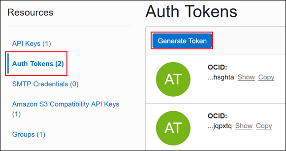
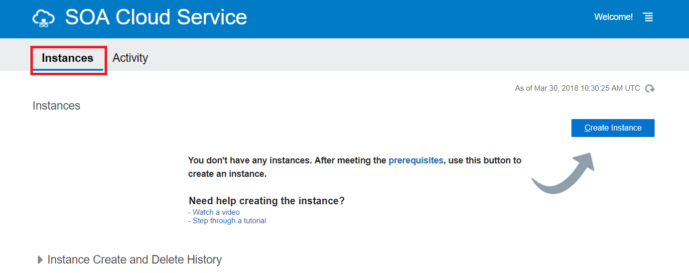
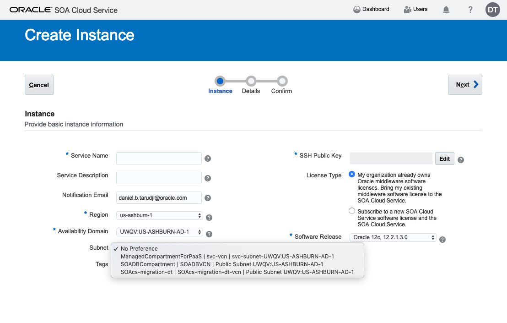
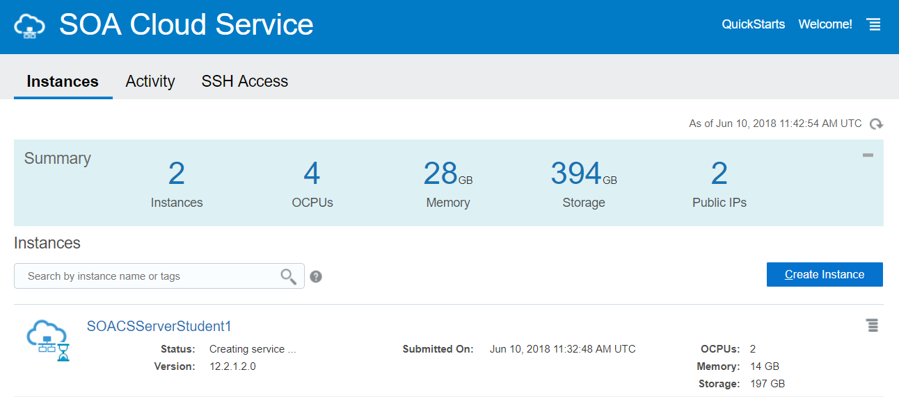

# Lab 100 - Provision Oracle SOA Cloud Service

---

# Objectives

- In this activity, you provision your Oracle SOA Cloud Service Instance.


## Required Artifacts

- Your Oracle Cloud Infrastructure user name and password.

If you don't have the user name, password, and web console URL, contact your organization's Oracle Cloud administrator who subscribed to Oracle Cloud Infrastructure.

# Pre-requisites
- The PaaS service instance (Oracle SOA Cloud Service) requires certain networking, storage, security resources in Oracle Cloud Infrastructure. You must create these resources before you create the PaaS service instances.

## Detailed Steps

## 1. Create a Compartment

***Note: Create a compartment the first time you create an Oracle PaaS instance on Oracle Cloud Infrastructure. For subsequent PaaS instances, you can use the same or a new compartment. That choice is based on whether the services depend on other services. For example, a Java Cloud Service instance must be in the same VCN as the Database Cloud Service deployment that it is associated with. So the infrastructure resources that you create for the Java Cloud Service instance and the associated Database Cloud Service deployment must be in the same compartment.***

- Sign in to the Oracle Cloud Infrastructure web console

- Click  near the upper left corner of the web console

- In the menu that appears, under **Identity**, click **Compartments**

    

- On the Compartments page, click **Create Compartment**

- In the **Create Compartment** dialog box, enter a name and a description for the compartment, and then click **Create Compartment**

    

- Make a note of the compartment name. You'll need it later in this tutorial

## 2. Create a Virtual Cloud Network

***Note: Create a VCN the first time you create an Oracle PaaS instance on Oracle Cloud Infrastructure. For subsequent PaaS instances, you can use the same or a new VCN. That choice is based on whether the services depend on other services. For example, a Java Cloud Service instance must be in the same VCN as the Database Cloud Service deployment that it is associated with.***

- In the Oracle Cloud Infrastructure web console, from the **REGION** drop-down list, select the region in which you want to create the Oracle PaaS service instances

    ***Note: Select a region that's within the default data region of your account. If your default data region is EMEA, then select eu-frankfurt-1 or uk-london-1. If your default data region is North America, then select us-ashburn-1 or us-phoenix-1.***

    

- Click  near the upper left corner of the web console

- In the menu that appears, scroll down to **Networking**, and click **Virtual Cloud Networks**

    

- On the Virtual Cloud Networks page, click **Create Virtual Cloud Network**

- Select the compartment that you created, enter a name for the virtual cloud network, and then select **CREATE VIRTUAL CLOUD NETWORK PLUS RELATED RESOURCES**

    

- **Important:** Scroll down, and note the name of each subnet that you want to use for the Oracle PaaS instances

- Click **Create Virtual Cloud Network**

    Oracle Cloud Infrastructure creates a virtual cloud network with the CIDR block 10.0.0.0/16 and one public subnet in each availability domain.

## 3. Permit PaaS Services to Use the Network Resources in Oracle Cloud Infrastructure

***Note: Create a policy the first time you create an Oracle PaaS instance on Oracle Cloud Infrastructure. For subsequent PaaS instances, you can use the same or a new policy. That choice is based on whether the services depend on other services. For example, a Java Cloud Service instance must be in the same VCN as the Database Cloud Service deployment that it is associated with. So they must be in the same compartment, and must be subject to a single policy.***

- Click   near the upper left corner of the web console

- In the menu that appears, under **Identity**, click **Policies**

    

- On the Policies page, select the **root** compartment for your tenancy, and then click **Create Policy**

    

- In the **Create Policy** dialog box, enter a name and a description for the policy

- In the **Policy Versioning** field, specify the definitions of the verbs and resources that the policy must use

    - To specify that the policy must reflect future changes to the definitions of the policy verbs and resources, select **KEEP POLICY CURRENT**

    - To specify that the policy must use the definitions in effect on a specific date, select **USE VERSION DATE**, and then enter the date in the YYYY-MM-DD format

- In the **Policy Statements** field, enter the following policy statement. This statement is the first of four policy statements that you'll add

    ***Note: Replace <compartment_name> with the name of the compartment that you created earlier in this tutorial. Don't change anything else in the policy statement.***

    ```javascript
    Allow service PSM to inspect vcns in compartment <compartment_name>
    ```
- Click plus  button to add a policy to add the next policy

- Add the following policies, *one at a time*

    ```javascript
    Allow service PSM to use subnets in compartment <compartment_name>

    Allow service PSM to use vnics in compartment <compartment_name>

    Allow service PSM to manage security-lists in compartment <compartment_name>
    ```
    The following screenshot shows the Create Policy dialog box after entering the required policy statements

    

- After you add all the policies, click **Create**

## 4. Create Object Storage Buckets

Oracle PaaS service instances use buckets in Oracle Cloud Infrastructure Object Storage to store backups and other artifacts.

***Note: As an administrative best practice, create a separate bucket for each PaaS instance that you intend to create in Oracle Cloud Infrastructure.***

- In the Oracle Cloud Infrastructure web console, from the **REGION** drop-down list, select the region in which you want to create the Oracle PaaS service instances

    ***Note: Select a region that's within the default data region of your account. If your default data region is EMEA, then select eu-frankfurt-1 or uk-london-1. If your default data region is North America, then select us-ashburn-1 or us-phoenix-1.***

    

- Click   near the upper left corner of the web console

- In the menu that appears, scroll down to **Storage**, and click **Object Storage**

    

- On the Buckets page, select the compartment that you created, and then click **Create Bucket**

    

- In the **Create Bucket** dialog box, enter a name for the bucket

    **Important:** Note this name. You'll need it later when you create the Oracle PaaS instance.

- Click **Create Bucket**

    

- Repeat the steps in this section to create a bucket for each Oracle PaaS service instance that you intend to create in Oracle Cloud Infrastructure

## 5. Generate Auth Tokens

Oracle platform services that use Oracle Cloud Infrastructure Object Storage to store backups require an auth token for authentication.

Generate an auth token for each user who created buckets or has permission to access them. For example, if *java_user* created a bucket for Java Cloud Service, and *db_user* created a bucket for Database Cloud Service, then generate a separate auth token for each of these users. If the same user created both the buckets or can access both buckets, then generate a single auth token for that user.

- Sign in to the Oracle Cloud Infrastructure web console as the user who created the buckets or has permission to access them

- Click the user name at the top, and then select **User Settings**

    

- In the **Resources** navigation pane, click **Auth Tokens**, and then click **Generate Token**
    
    

- In the **Generate Token** dialog box, enter a description for the token, and then click **Generate Token**

    

- **Important:** Copy and store the generated token. You'll need it later when you create the PaaS instances

- Repeat the steps in this section for each user who created buckets for PaaS instances

## Next Steps

You've created the necessary resources in Oracle Cloud Infrastructure. You can now create your Oracle SOACS PaaS instances in Oracle Cloud Infrastructure.

Here's a reminder of the information that you'll need from this tutorial when you create the Oracle PaaS instances:

- The name of the region in which you created the Oracle Cloud Infrastructure resources (for example, us-phoenix-1)

- The names of the subnets to which you'll attach your Oracle PaaS instances (for example, *Public Subnet iKgW:PHX-AD-1* and *Public Subnet iKgW:PHX-AD-2*). You'll need to select the subnet while creating your PaaS service instance using the service web console

- The OCIDs of the subnets to which you'll attach your Oracle PaaS instances. To create PaaS service instances using the REST API or CLI, you must specify the OCID of the subnet (and not the subnet name) in the request body

- The names of the object storage buckets that you created

- The auth token for each user who created buckets for PaaS instances

# Creating and Provisionig a SOACS Instance

- Open a browser window and go to Oracle Cloud My Services:
***https://myservices.DC_code.oraclecloud.com***

- Sign in to your Services Console using your identity domain, user name and password.

- In the Oracle Cloud My Services page, click the menu icon on the left and then choose the **SOA** link under Services.

    

- On the Oracle SOA Cloud Service page, under Instances tab, click **Create Instance**.

    

### Providing Basic Service Instance Information

Enter the basic information for your instance.

**Service Name:** SOACSServerStudent **`X`**
where `X` is the student number alloted to you (1,2,3,....)

**Service Description:** Optionally describe the service instance.

**Region:** us-ashburn-1

**Availability Domain:** oscnas152599 | oscnas152599VCN | Public Subnet IpXs:US-ASHBURN-AD-3

**Subnet:** IpXs:US-ASHBURN-AD-3

**Tags:** `SOACSWorkshop` and optionally your name

**SSH Public Key:** Click **Edit**. Select **Create a New Key**. Click **Enter**.


Click **Download** and Click **Done** after the keys get downloaded. You will not be able to proceed without downloading the keys.


**Software Release:** Oracle 12c 12.2.1.2.0



Click **Next** to specify **Service Details**.

### Specifying Service Details

Select the various details required for your service instance.

#### Select Service Type

**Service Type:** SOA with SB and B2B

#### Weblogic

**Compute Shape:** VM.Standard1.2 - 2.0 OCPU, 14.0GB RAM

**Username:** weblogic

**Password:** Alpha2018_

**Confirm Password:** Alpha2018_

**Enable Admin Console:** Checked

#### Database Configuration

**Name:** SOACSDBStudent **`X`**
where `X` is the student number alloted to you (1,2,3,....)

***Note:*** The DBCS instances are pre-provisioned for the labs per sutdent number (1,2,3,....)

**Administration User Name:** SYS

**Password:** Alpha2018_

#### Backup and Recovery Configuration

**Storage Container Name:** 
Specify the name of the container in this format: `https|http://<storagedomain>/{version}/<schema name>/<container name> or <storage service name>-<identity domain name>/<container name>`.

For example, **https://uscom-east-1.storage.oraclecloud.com/v1/Storage-oscnas001/mySOACSServerStudentXBucket**, where uscom-east-1 is the name of your identity domain and mySOACSServerStudent **`X`** Bucket is the name of the container that you want to create/created for service instance backups with `X` being the student number alloted to you.

**Storage User Name:** Enter the same user name that you used to log in to the Oracle Cloud My Services page.

**Cloud Storage Password:** Enter the same password that you used to log in to the Oracle Cloud My Services page.

**Create Cloud Storage Container:** Checked

***Note:*** The provisioning wizard automatically creates the storage container.

### Confirming Your Subscription Selections

The provisioning wizard validates your entries and presents you with your choices on the **Confirmation** page. When you are satisfied with your choices, click **Create**.


***Note:*** It takes about an hour and a half to create the instance.



You now have provisioned Oracle SOA Cloud Service.

This SOACS Provisioning Lab is now completed.
