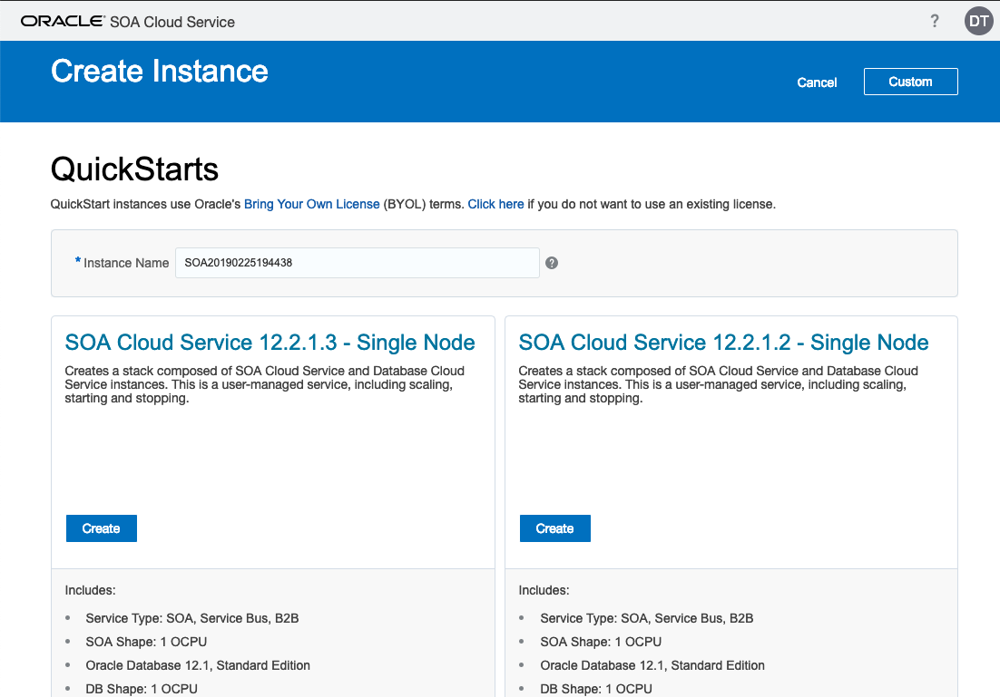

# Lab 100 - Provision Oracle SOA Cloud Service

---

## Objectives

- In this activity, you provision your Oracle SOA Cloud Service Instance.

## Required Artifacts

- The following lab and an Oracle Public Cloud account that will be supplied by your instructor.

## Pre-requisites

- Creating a Secure Shell (SSH) Key Pair

- Creating an Oracle Database Cloud Service Instance

## Creating SSH Keys for Use with Oracle Cloud Services

### Purpose

This tutorial covers how to create a secure shell (SSH) key pair by using PuTTY on Windows.

### What Do You Need

PuTTY

PuTTY is a free, open-source implementation of several network protocols, including SSH. It is available for Windows and for UNIX platforms. PuTTY includes several utilities including a terminal emulator, an SSH key generator, and a network transfer application. For this tutorial we will use the PuTTY Key Generator (***puttygen.exe***) for Windows.

PuTTY is available from many sites, but you can reach the main download site http://www.putty.org.

Before starting this tutorial, you should have:

- Installed PuTTY on your computer with a Windows operating system.

### Generating an SSH Key Pair Using PuTTY Key Generator

- Find ***puttygen.exe*** in the PuTTY folder on your computer, for example, ***C:\Program Files (x86)\PuTTY***. Double-click ***puttygen.exe*** to open it.

- Accept the default key type, **SSH-2 RSA**.

    

    **SSH-2** is the most recent version of the SSH protocol (and is incompatible with SSH-1). **RSA** and DSA are algorithms for computing digital signatures.

- Set the **Number of bits in a generated key** to 2048 bits, if it is not already set with that value.
This sets the size of your key and thus the security level. A minimum of 2048 bits is recommended for SSH-2 RSA.

    

- Click **Generate**.

    

- Move your mouse around the blank area to generate randomness to the key.

    

    ***NOTE:*** The dotted red line in the image below is for illustration purposes only. It does not appear in the generator pane as you move the mouse.

- The generated key appears under **Public key for pasting into OpenSSH authorized_keys** file.

    

- The key comment is the name of the key that you will use to identify it. You can keep the generated key comment or create your own.

    

- If you want to password-protect your key, enter a **Key passphrase** and enter it again for **Confirm passphrase**. When you reload a saved private key, you will be asked for the passphrase, if one is set.

    

    While a passphrase is not required, you should specify one as a security measure to protect the private key from unauthorized use.
    There is no way to recover a passphrase if you forget it.

- Save the private key of the key pair. Depending how you work with the private key in the future, you may need one saved in the PuTTY PPK format and one saved in OpenSSH format. Let's do both.

    - a) To save the key in the PuTTY PPK format, click **Save private key** to save the private key of the key pair.

        

        You can name it anything you want, although you may want to use the same name as you used for the key comment. The private key is saved in PuTTY's Private Key (PPK) format, which is a proprietary format that works only with the PuTTY toolset.

        

        You can use this key whenever you use Putty to perform SSH actions.

    - b) To save the key in OpenSSH format, open the **Conversions** menu and select **Export SSH key**. This will be the same key as above, just saved in a different format.
    
        

        You can name it anything you want, but to keep track of your keys, you should give it the same name as the key you saved in PPK format in the previous step. You can also use any extension (or no extension), but let's use ***.ssh***, to make it clear what format it is.

        

        You can use this key whenever you use OpenSSH to perform SSH actions using ssh utitlities that support OpenSSH, for example when using Linux in a command shell.

- Now you need to create the public key to be paired with the private key(s) you just created. However, clicking the **Save public key** button will create a public key that won't work with Oracle Cloud services in certain cases. So, for the purposes of this tutorial, there is no reason to save a public key using the **Save public key** button.

    

    Instead, proceed as follows.

- In the PuTTY Key Generator, select all of the characters under **Public key for pasting into OpenSSH authorized_keys** file.
Make sure you select all the characters, not just the ones you can see in the narrow window. If a scroll bar is next to the characters, you aren't seeing all the characters.

    

- Right click somewhere in the selected text and select **Copy** from the menu.

    

- Open a text editor and paste the characters, just as you copied them. Start at the first character in the text editor, and do not insert any line breaks.

    

- Save the key as a text file, using the same root name as you used for the private key. Add a ***.pub*** extension. You can give it any extension you want, but ***.pub*** is a useful convention to indicate that this is a public key.

    

- Write down the names of your public and private keys, and note where they are saved. You will need the public key when creating service instances in, for example, Oracle Java Cloud Service and Oracle Database Cloud - Database as a Service. You will need the private key when trying to access a service instance's virtual machine via SSH.

## Creating an Oracle Database Cloud Service Instance

### Purpose

This tutorial shows you how to create a service instance in Oracle Database Cloud Service (Database as a Service).

### Starting the Create Oracle Database Cloud Service Wizard

- Open a browser window and go to Oracle Cloud My Services:
***https://myservices.DC_code.oraclecloud.com/***

- Sign in to your Services Console using your identity domain.

- Enter your user name and password.

- In the Oracle Cloud My Services page, click the menu icon on the left and then choose the **Database** link under Services.

    

- On the Oracle Database Cloud Service page, click **Create Instance**.

    

The Create Database Cloud Service Instance wizard displays the Service page.

### Specifying the Basic Service Information

In this section, you provide basic information, including the service level and billing frequency, the Oracle Database software release that you want to run on your instance, and the edition of that software release.

- On the **Instance** page, specify the following values:

    **Instance Name:** SOA12cEEDB

    **Description:** Enter an optional description of the service.

    **Software Release:** Oracle Database 12c Release 1

    **Software Edition:** Enterprise Edition

    **Database Type:** Single Instance

    
    
    Click **Next**. The **Instance Details** page appears.

- On the **Details** page, specify the following values:

    **Database Configuration section:**

    **DB Name:** ORCL

    **PDB Name:** PDB1

    **Administration Password:** Enter a password for the DB administrator

    **onfirm Password:** Confirm the password

    **Usable Database Storage (GB):** 25

    **Compute Shape:** Select a compute shape from the list. For this tutorial, use the default value.

   ***NOTE:*** The compute shape specifies the number of Oracle Compute Units and amount of memory (RAM) for the virtual machine hosting the new service instance.

    **SSH Public Key:** Click **Edit**. Select Key file name and click Choose File to select the file you created earlier that contains the public key for the secure shell (SSH). Click **Enter**.    

    

    **Backup and Recovery Configuration section:**

    **Backup Destination:** Be sure to select Both Cloud Storage and Local Storage from the dropdown menu. 
    
    ***NOTE:*** If you don’t select Both Cloud Storage and Local Storage, the Oracle SOA Cloud Service provisioning wizard will not present that Oracle Database Cloud Service instance as an available database in the Oracle SOA Cloud Service provisioning wizard.
    
    **Cloud Storage Container:** 
    You can keep the default value for this purpose, but if you want to specify a different name, specify the name of the container in this format: `https|http://<storagedomain>/{version}/<schema name>/<container name> or <storage service name>-<identity domain name>/<container name>`.
    
    For example, **https://xxxxxxx.us.storage.oraclecloud.com/v1/Storage-xxxxxxx/container**, where xxxxxxx is the name of your identity domain and container is the name of the container that you want to create/created for service instance backups.

    **Username:** Enter the same user name that you used to log in to the Oracle Cloud My Services page.

    **Password:** Enter the same password that you used to log in to the Oracle Cloud My Services page.

    **Create Cloud Storage Container:** Checked

    ***Note:*** The provisioning wizard automatically creates the storage container.

    

    Click **Next**. The **Confirmation** page appears.

- On the **Confirmation** page:

    Review your database definition choices and click **Create**.

    

- Return to the Oracle Database Cloud Service console to see your new database instance listed, with a status of In Progress until the instance creation is completed. Instance creation can take 20 minutes or more.

    

## Introduction

This is the first of several labs that are part of the **SOACS** workshop.

Before beginning this portion of the tutorial, you should have already completed these OBEs:

- Creating a Secure Shell (SSH) Key Pair

- Creating an Oracle Database Cloud Service Instance

In this activity, you provision your Oracle SOA Cloud Service Instance. You will need to use the values
you supplied in the OBEs listed above. Be sure you have the following information available:

- The name of the SSH public key file you created earlier

- The name of the database instance you created earlier

- The database administrator password you provided earlier

## Creating an Instance

- Open a browser window and go to Oracle Cloud My Services:
***https://myservices.DC_code.oraclecloud.com***

- Sign in to your Services Console using your identity domain, user name and password.

- In the Oracle Cloud My Services page, click the menu icon on the left and then choose the **SOA** link under Services.

    

- On the Oracle SOA Cloud Service page, under Instances tab, click **Create Instance**.

    

### Providing Basic Service Instance Information

Enter the basic information for your instance.

**Service Name:** SOACS

**Service Description:** Optionally describe the service instance.

**Region:** us-ashburn-1

**Availability Domain:** Leave Default

**Subnet:** Leave Default

**SSH Public Key:** Click **Edit**. Select Key file name and click Choose File to select the file you created earlier that contains the public key for the secure shell (SSH). Click **Enter**.

**Software Release:** Oracle 12c 12.2.1.2.0

Click **Next** to specify **Service Details**.

### Specifying Service Details

Select the various details required for your service instance.

#### Select Service Type

**Service Type:** SOA with SB and B2B

#### Weblogic

**Compute Shape:** OC2M- 2 OCPUs and 30 GB RAM.

**Username:** weblogic

**Password:** welcome1

**Confirm Password:** welcome1

**Enable Admin Console:** Checked

#### Database Configuration

**Name:** SOA12cEEDB (One created in the DB Provisioning previously)

**Administration User Name:** SYS

**Password:** Database administrator password provided during DB Provisioing previously

#### Backup and Recovery Configuration

**Storage Container Name:** 
Specify the name of the container in this format: `https|http://<storagedomain>/{version}/<schema name>/<container name> or <storage service name>-<identity domain name>/<container name>`.

For example, **https://xxxxxxx.us.storage.oraclecloud.com/v1/Storage-xxxxxxx/container**, where xxxxxxx is the name of your identity domain and container is the name of the container that you want to create/created for service instance backups.

**Storage User Name:** Enter the same user name that you used to log in to the Oracle Cloud My Services page.

**Cloud Storage Password:** Enter the same password that you used to log in to the Oracle Cloud My Services page.

**Create Cloud Storage Container:** Checked

***Note:*** The provisioning wizard automatically creates the storage container.

#### Load Balancer Configuration

**Provision Load Balancer:** Checked

**Load Balancer Policy:** Round Robin

This option passes each new request to the next managed server in line, evenly distributing requests across all managed servers regardless of the number of connections or response time.

**Compute Shape:** OC3- 1 OCPU 7.5 GB RAM

Click **Next**.

### Confirming Your Subscription Selections

The provisioning wizard validates your entries and presents you with your choices on the **Confirmation** page. When you are satisfied with your choices, click **Create**.

***Note:*** It takes about an hour and a half to create the instance.

You now have provisioned Oracle SOA Cloud Service.

This SOACS Provisioning Lab is now completed.
