# Lab 200 - Development of ValidatePayment Composite

---

## Introduction

This is the second of several labs that are part of the **SOACS** Workshop. 

This lab is broken down into the following parts –

- Building a SOA Composite. It covers modifying the DB Adapter to reflect your particular cloud environment.

- Deploying the composite via Oracle Enterprise Manager Fusion Middleware Control (EM FMWC).

The activities in this document aim to introduce you to key new features such as:

- Design Times in JDeveloper – SOA

- Lift and Shift SOA Composites to SOACS

## Validate Payment: SOA Composites 

Avitek has embarked upon an IT modernization project to align with business goals of improving customer satisfaction. A key area of improvement will involve streamlining the order process to provide better visibility tracking of orders as they go through the steps of credit approvals, fulfillment, shipment and delivery.

One key issue in the current system is that credit card payments are often denied for various, sometimes minor reasons, expired date, etc.  Since the process to correct these issues varies across Avitek’s order entry systems, there is no consistent follow-up and resolution for such issues. Orders end up getting lost and delayed in the system, causing extreme customer dissatisfaction.
The business has indicated that a new credit card fraud detection system must be put in place before the end of the year, in order to thwart credit card abuses. A consistent fraud mechanism will require the credit validation process to be consolidated across all order entry systems.  

The first step will be to provide a consistent interface to all order entry applications for credit validation.  Initially, the consolidated credit validation service will be hosted in-house to control quality; however, once the interface has been stabilized, this service will be outsourced to a third party provider.  So what will be done now, means that, in the future, when Avitek decides to outsource credit validation to an external provider, this can be accomplished without impacting existing applications.  

In this section, you will build your SOA Suite 12c composite. This composite will provide a consistent interface to all order entry applications for credit validation.

## Pre-requisites

### VNC

- VNCViewer has been downloaded and installed on your machine. VNCViewer is available for various operating systems here - https://www.realvnc.com/en/connect/download/viewer/

- Configure VNC Viewer. Click File->New Connection

    

- Enter the VNC Server **IP:Port** and an optional name for the instance. Click **OK**

    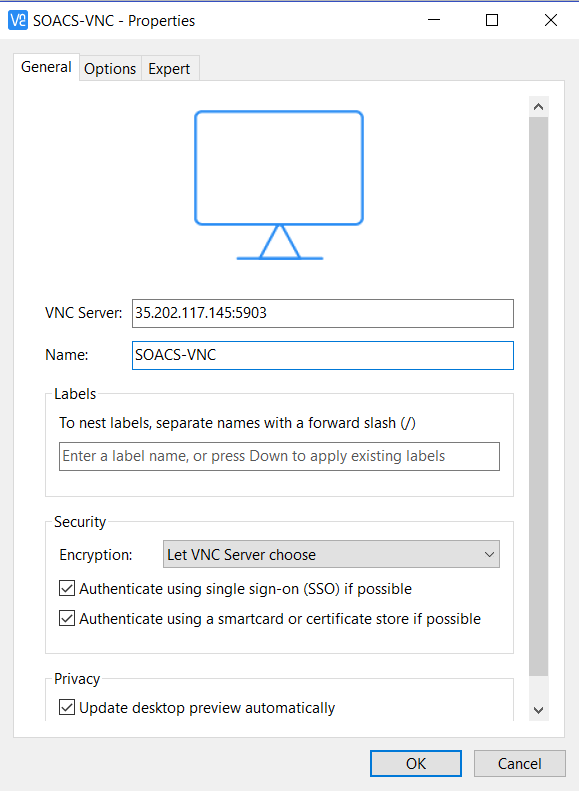

- Double click the newly created instance and enter the password for the VNC Server when prompted and click **OK**

    

### Resources

- Tutorial resources have been downloaded and unzipped to a directory of your choice. When referring to any resources in the following chapters (for example **wsdl** or **sample input**), we will always refer to directories, relative to the unzipped location e.g. 
**~\Resources**. For example **~\Resources\sample_input\input.xml**.

## High-Level Steps

-   Create Datasources and update the Database Adapter

-   Start JDeveloper

-	Open the SOA composite application provided

-	Review the various components of the composite

-	Update the Database adapter reference in JDeveloper to use the DBCS instance that we provisioned in the previous lab

-   Review the BPEL process

-   Create a SAR deployment

-   Open the HTTP Port on SOACS instance

-	Deploy and test the project

## Steps in Detail

**Create Datasources and update the Database Adapter**

- Open the Weblogic Server Console from the SOACS instance.

    

- Enter credentials and login.

    

- Click on **Data Sources** under **Services**.

    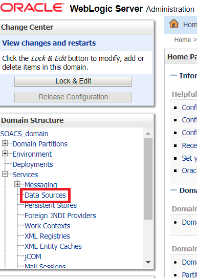

- Click on **Lock & Edit** on the top left hand side.

    

- Click on New **Generic Data Source**.

    

- Enter the **Name** as **`SOACS_Demo_DS`** and enter the **JNDI Name** as **jdbc/soademo**. Click **Next**.

    

- Keep the default driver **Oracle's Driver (Thin XA) for Service connections**. Click **Next**.

    

- Click **Next** after reviewing the XA options.

    

- Enter the connection details to the DBCS instance for the data source.

    The database name, host name and port are obtained from the pre-configured DBCS instance (SOACSDBStudent`X`) where `X` is the alloted student number. Please refer to the details provided to you at the time of workshop for filling the Database information.
    
    - **Database Name:** Per details shared

    - **Host Name:** Per details shared

    - **Port:** 1521

    - **Database User Name:** soademo

    - **Password:** soademo

    - **Confirm Password:** soademo

        
    
        Click **Next**.
    
- Click **Test Configuration** and make sure the **Connection test succeeded** message comes up. Click **Next**.
    
    

- Select the SOACS_cluster checkbox and click **Finish**.

    

- Click on **Activate Changes** and make sure there are no issues.

    

    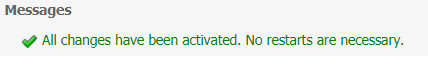

- Click **Lock & Edit** again. Select **Deployments**.

    

- Click **Customize this table**.

    

- Select **Exclude libraries** checkbox, and set the **Number of rows** to 100 and click **Apply**.

    

- Select **DbAdapter** application.

    

- Select the **Configuration** tab and **Outbound Connection Pools** tab. Click **New**.

    

- Select **javax.resource.cci.ConnectionFactory** and click **Next**.

    

- Set the **JNDI Name** to ***eis/DBCS/SOADEMO***. Click **Finish**.

    

- Click **OK** in the next screen to save the new Plan.

    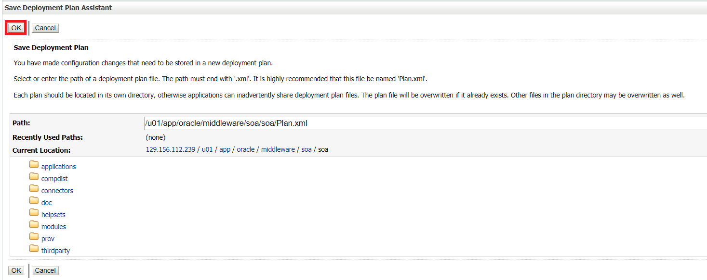

- Click on the newly created Outbound Connection ***eis/DBCS/SOADEMO***.

    

- Set the XADataSourceName to **jdbc/soademo**. Hit **Enter** on the keyboard. Click **Save**.

    

- Click **Activate Changes** and make sure there are no errors.

    

- Back in the **Deployments** screen, select **Lock & Edit**. Select the **DbAdapter** checkbox and click **Update**.

    

- Click **Next**.

    

- Click **Finish**.

    

- Click **Activate Changes** and make sure there are no errors.

    

**Start JDeveloper**

- Make sure JDeveloper is not already running. Double click on **JDeveloper** on the Desktop.

- Once the Select Role dialog comes up, accept the default ***Studio Developer (All Features).***

  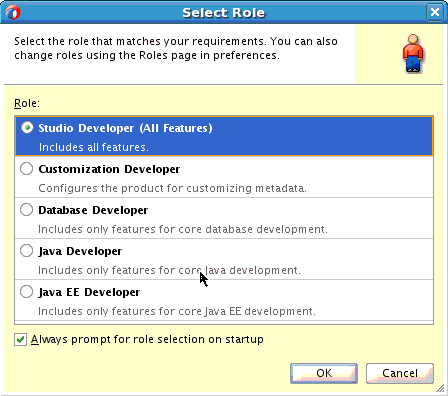

- Click **OK**.

**Open the SOA composite application and project**

In this section, you will open your Oracle SOA Suite 12c composite to validate a credit card payment.  
Here credit card payments will be validated and the payment status will be returned. If the payment is denied, the order will not be processed. You will update the Database adapter reference to point to the DBCS instance that you provisioned in the first Lab.

Once done, your composite should be as follows -

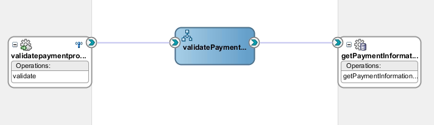

All available credit cards will be stored in the database, including payment type, card number, expiry date, card name and daily limit. 

The incoming order message includes the credit card information. 

For example, the payment part of the order message would look like this:

```javascript
<soas:Billing>
	<soas:CardPaymentType>1</soas:CardPaymentType>
	<soas:CardNum>1234123412341234</soas:CardNum>
	<soas:ExpireDate>0316</soas:ExpireDate>
	<soas:CardName>AMEX</soas:CardName>
	<soas:BillingAddress>
        <soas:FirstName>Daniel</soas:FirstName>
		<soas:LastName>Day-Lewis</soas:LastName>
		<soas:AddressLine>555 Beverly Lane</soas:AddressLine>
		<soas:City>Hollywood</soas:City>
		<soas:State>CA</soas:State>
		<soas:ZipCode>12345</soas:ZipCode>
		<soas:PhoneNumber>5127691108</soas:PhoneNumber>
	</soas:BillingAddress>
</soas:Billing>
```

The validation process has three steps:

1.	The payment information is retrieved from the database, using the credit card number, quoted in the order message, as the key. If there is no data available for this credit card number, then the payment is denied. 

2.	If data for the credit card number is available, the expiry date in the database record is compared to the expiry date listed in the order message. If they are not the same, the payment is denied.

3.	The last check looks at whether the total order amount is less than the daily limit on the credit card in the database. If this is not the case, then the payment is also denied.

    If all tests are successful, then the payment is authorized.

    The implementation of this service uses a BPEL process to retrieve the credit card data from the database and perform the tests outlined above. The service will return either `Authorized` or `Denied` as the payment status.
    
Open the SOA Composite application provided.

-	From the **Applications** menu, click on **Open Application**.

    

-	 Browse to **e2e-1201-composites.jws** from **~\Resources\SOA** folder.

        ***Note:*** You may have to open the application from **/u02/training/SOAJdevProjects/e2e-1201-composites** folder if connected to a remote server through VNC or other software.

-   A project **“ValidatePayment”** is opened with some predefined components. 

-   Double click the composite  and view the contents of the composite. You now have a canvas displaying three swim lanes: services, components, and references.

    

**Update the Database adapter reference in JDeveloper**

- The External References swim lane contains the **getPaymentInformation** database adapter.  

  This adapter service will provide the payment information from the database, using the credit card number as the key. Based on expiry date, daily limit, and the total amount of the order, we will then calculate whether the payment is authorized or denied. 
  The database adapter will process your choices, and provides a service that implements the operation specified.  The WSDL file to represent that service is **getPaymentInformation.wsdl**.

  You can see the .jca file of the **getPaymentInformation** database adapter, together with two XML files under the **Adapters** subfolder and the WSDL file of the **getPaymentInformation** service under the **WSDLs** subfolder. 
  
  A schema file **getPaymentInformation_table.xsd** has also been created. This is used to define the input and output variables for the DB adapter call.

  The adapter does a select on the E2E_1201_PAYMENT_INFO table hosted on the Database Cloud Service that was provisioned. You can update the connection to the DBCS instance and browse the tables –

    

- Double click the **getPaymentInformation** database adapter.

    

- Click **Next**.

- Change the JNDI name to ***eis/DBCS/SOADEMO***. Click on the edit (pencil) icon for the connection **SOA**.

    

- Enter the following details in the configuration wizard and click on **Test Connection**. Once you see **Success!** click on **OK**.

    

    **Connection Type:** Oracle (JDBC)

    **Username:** soademo

    **Password:** soademo

    **Driver:** thin

    Host name and service name can be found out from the DBCS instance as shown below.

    

    **Host Name:** IP Address of the DBCS instance
    
    **Service Name:** Service name of the DBCS instance

    **JDBC Port:** 1521

- Click **Next**.

- Click **Next** after reviewing the details on each screen.

    

    

    

    

    

    

    

    

- Click **Finish**.

- Save all by clicking the  button on the top.

- Check the contents of the **`E2E_1201_PAYMENTINFO`** table by opening the SQL Worksheet and typing the following command-

    `select * from E2E_1201_PAYMENTINFO;`

    

    

    

    ***Note:*** There are 2 rows in the table.

-	The Exposed Service **`validatepaymentprocess_client_ep`** is the external client web service that will provide the external interface to the BPEL process. 

**Review the validatePayment BPEL process**

-	Double-click the BPEL process to open the BPEL designer. Notice the **getPaymentInformation** partnerlink already in the **Partner Links** swim lane. It is also connected via the **Invoke** activity.
  
    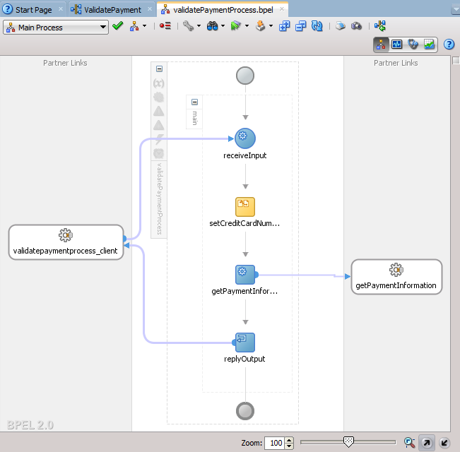

-	The input and output variables for the adapter call are also defined. They are leveraged when the DB adapter is invoked.

-	The assign activity assigns the credit card number in the incoming payment information (in the process input variable) to the input variable of the database adapter.

-	Select the transform activity **calculatePaymentStatus**, and check out the property inspector window.

-	You will see that the transformation expects two input variables: The output variable of the database adapter, which includes the payment information stored in the database, and the input variable of the BPEL process, which includes the total order amount.

-	The output is the **status** field in the process output message, which will either be set to `“Denied”` or `“Authorized”`.

    

- If you want to see the definition of the XSLT file, click the **edit** button at the bottom:

    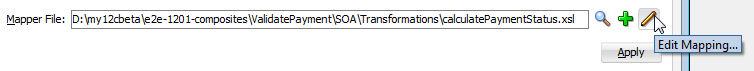

-	This opens the mapper file.

-	Click **Expand All Child Nodes** on **Source** and **Target** and click on the little plus sign next to the function in the middle.

    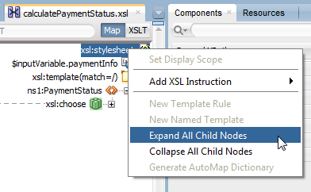

    

-	The XSLT map checks whether

    a) expireDate in order input and DB are the same AND
    
    b) AuthorizationAmount (= total order price) is smaller than daily limit on credit card

-	**Save All** and close the XSLT Map.

**Open the HTTP Port on SOACS instance**

- Add an access rule in the SOA Cloud Service Console to permit traffic on HTTP port (80).

    Click on the hamburger icon and select **Access Rules**

    

- Click **Create Rule**.

    
    
- Enter the details as in the below screenshot and click **Create**.

    

**Deploy the SOA composite**

The design iteration is complete and you are now ready to deploy the composite to the server.

-	Right-click on the project name in the project menu - select **Deploy** and your **project name**. Make sure you have the project menu and not the application menu in order to see this option.

    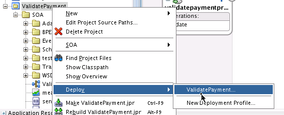

-	Select the second option **Generate SAR File**.

    

-	Click **Next**.

-	For our labs, we will deploy with Revision ID 1.0.

    

	This will now be your default deployment profile, until you change it.

-	Click **Next**.

-   Note the deployment location.

    

-	Click **Finish**.

-	Next the application is built and deployed to a SAR file. If there are no compilation errors, you will see on the SOA log, at the bottom of JDeveloper, **BUILD SUCCESSFUL** and then the deployment starts.

    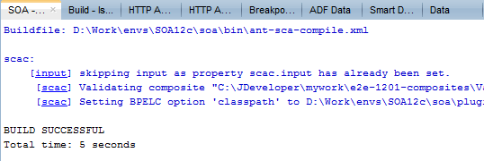

- In the Deployment log, view the details of the deployment.

    

    

- Open the EM console from the SOACS instance.

    

- Enter credentials and login.

    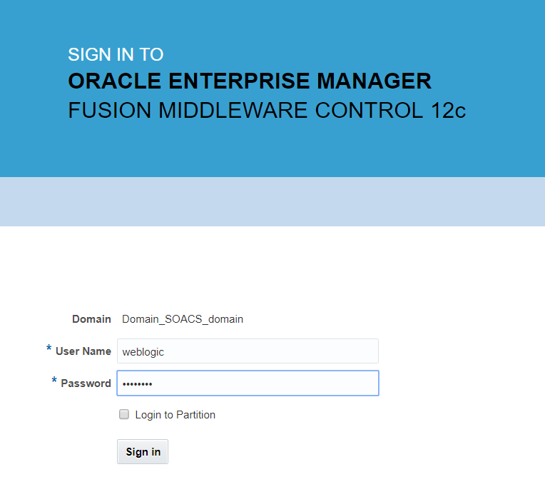

- Navigate to the composite home page or **soa-infra** node through following.

    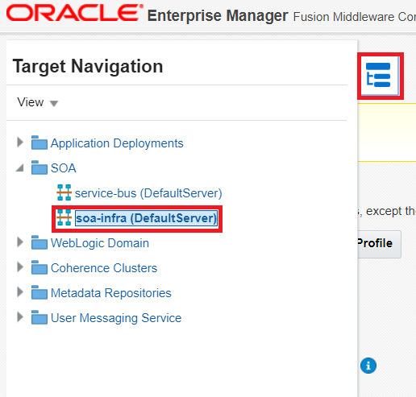

- Click on **Deployed Composites** and click **Deploy**.

    

- Select the deployment archive using **Choose File** from the SAR location deployed previously from JDeveloper. Click **Next**.

    

- Select the **default** option for **SOA Folder**. Click **Next**.

    

- Check the confirmation screen and click **Deploy**.

    

- After a few seconds, the deployment should be successful as below. Click **Close**.

    

    

- Back in the **Deployed Composites** screen, the **ValidatePayment** composite should be visible.

    

**Test the SOA composite with EM FMWC**

The Oracle Enterprise Manager Fusion Middleware Control allows you to test your services. We will use the ValidatePayment composite as an example.

-	If Enterprise Manager is not open, go to the SOACS instance and open it.

      

-	Navigate to the composite home page or **soa-infra** node through following.

    

    

-	Select the **ValidatePayment** composite (or the composite you want to test).

-	On this page, you can see the **Recent Instances, Fault Instances, Component Metrics, and the Services and References Metrics**.

-	Click the **Test** button at the top of the screen.  

    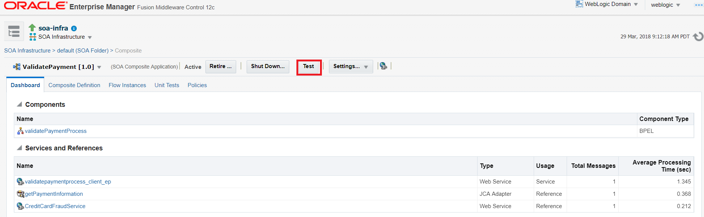

-	The **Test** page opens.

    

- You can see the **WSDL location, Operations list**, and two tabs, **Request** and **Response** for the test message.

    Scroll down to the **Input Arguments** section

- Specify your values for the payload. You can use the **HTML form** on the **Tree View**, which is default, or the **XML source** on the **XML View**. For smaller amounts of the data, using the HTML form view is probably easier. But for large payloads, it's easier to copy-and-paste your data into the XML View.

    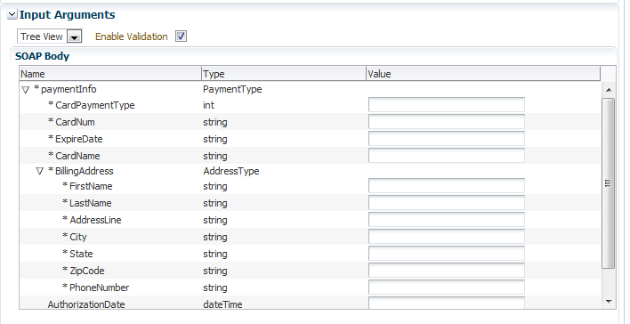

  When testing in EM FMWC you need to add a SOAP envelope to the test message. In order to make testing easier, we already added the soap envelope to the test messages.

  There are two sample message available in **`~\Resources\sample_input`** to test the validatePayment project: **`PaymentInfoSample_Authorized_soap.xml`**, and **`PaymentInfoSample_Denied_soap.xml`**.
 
- Enter the data or switch to XML view and use the **`PaymentInfoSample_Authorized_soap.xml`** sample message.

-	Click **Test Web Service**.

    

- When the composite completes, the screen switches to the **Response** tab and the returned value is shown.

    

- From here, you can launch the Flow Trace of this instance.

    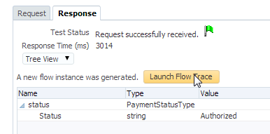

- Click **Launch Flow Trace**. The Flow Trace screen opens and you can see the flow of your composite and the status of each service, component and reference.

    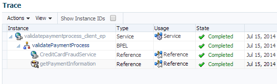

-	Click on the BPEL process to drill down into the instance details of the component

    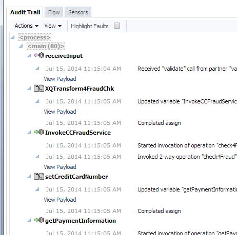

Congratulations - you have just completed the lab!
