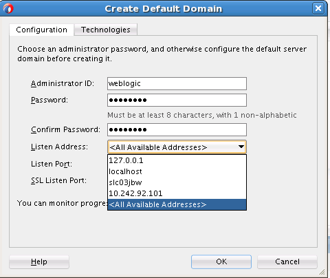
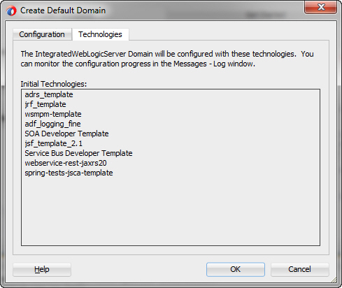
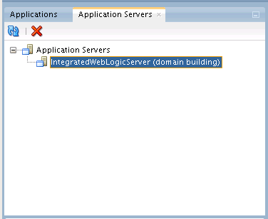
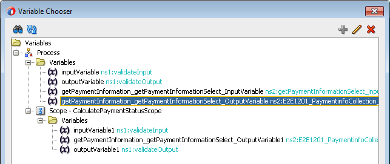
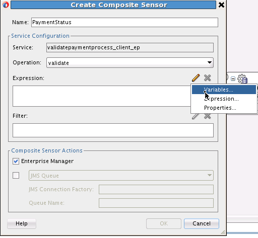
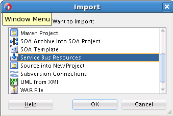
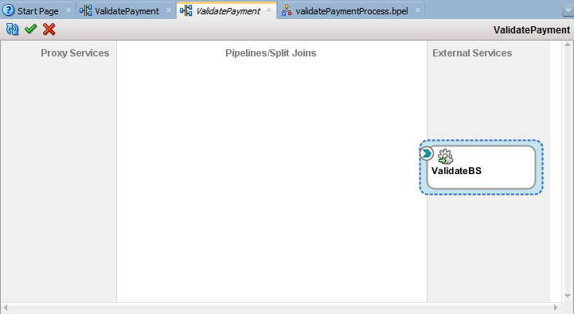

# Lab 200 - Development of ValidatePayment Composite

---

## Introduction

This is the second of several labs that are part of the **SOACS** Workshop. 

This lab is broken down into the following parts –

- Building a SOA Composite. It covers SOA templates, custom activity templates, composite sensors and BPEL debugging. It also details leveraging XQuery Transformations in a BPEL process.

- Virtualizing the composite created via Service Bus.

Developer Productivity is one of the key themes in the SOA Suite 12c release. The activities in this document aim to introduce you to key new features such as:

- All Design Times in JDeveloper – SOA and Service Bus

- Leveraging templates in BPEL and Service Bus

- More…

## Validate Payment: SOA Composites 

Avitek has embarked upon an IT modernization project to align with business goals of improving customer satisfaction. A key area of improvement will involve streamlining the order process to provide better visibility tracking of orders as they go through the steps of credit approvals, fulfillment, shipment and delivery.

One key issue in the current system is that credit card payments are often denied for various, sometimes minor reasons, expired date, etc.  Since the process to correct these issues varies across Avitek’s order entry systems, there is no consistent follow-up and resolution for such issues. Orders end up getting lost and delayed in the system, causing extreme customer dissatisfaction.
The business has indicated that a new credit card fraud detection system must be put in place before the end of the year, in order to thwart credit card abuses. A consistent fraud mechanism will require the credit validation process to be consolidated across all order entry systems.  

The first step will be to provide a consistent interface to all order entry applications for credit validation.  Initially, the consolidated credit validation service will be hosted in-house to control quality; however, once the interface has been stabilized, this service will be outsourced to a third party provider.  So what will be done now, means that, in the future, when Avitek decides to outsource credit validation to an external provider, this can be accomplished without impacting existing applications.  

In this section, you will build your first SOA Suite 12c composite. At the end, your solution will be as follows, from an architectural perspective:     


## Pre-requisites

- Tutorial resources have been downloaded and unzipped to a directory of your choice. When referring to any resources in the following chapters (for example **wsdl** or **sample input**), we will always refer to directories, relative to the unzipped location e.g. 
**~\Resources**. For example **~\Resources\sample_input\input.xml**.

## Start JDeveloper and Integrated Server

### High-Level Steps

- Start JDeveloper

- Open the Application Server window

- Create the Integrated Server domain

- Start the Integrated Server

### Steps in Detail

#### Start JDeveloper

- Make sure JDeveloper is not already running. Double click on **JDeveloper** on the Desktop.

- Once the Select Role dialog comes up, accept the default ***Studio Developer (All Features).***

  

- Click **OK**.

#### Start the Integrated Server

You will start the integrated server first, since we need it up and running.

- Navigate to the menu option **Window -> Application Servers**

  

- Notice there is already a server defined. This is the **Integrated Server**. You can control the complete lifecycle of the Integrated Server within JDeveloper – i.e. **create, start, stop and delete**. As previously mentioned, the Integrated Server works with **JavaDB**, so there is no need to install a separate Oracle database or create an external managed server for core SOA and Service Bus applications.

  

- Right-click on the **IntegratedWebLogicServer** connection. Select **Create Default Domain…**

  

- You will be prompted to fill in your password for the Integrated Server. Set the password to
**welcome1**.

  

- Ensure the **Listen Addres**s is set to - `<All Available Addresses>`.

  

- Click on the **Technologies** tab to see which runtimes are included in the Domain.

  

  ***Note:*** The **SOA Developer** and **Service Bus Developer** template are included by default!

- Click OK. This will take several minutes and you can monitor progress in the Messages pane in the bottom center of JDeveloper screen.

  

  

- Once the domain has been created, you may right-click and select **Start Server Instance**.

  

  ***Note:*** When the server is started, you will see the browse the following folders -

  

- Look at your messages window pane, once you see `‘SOA Platform is running and accepting requests’` you are good to go.

  

## Build the Composite

In this section, you will build your first Oracle SOA Suite 12c composite to validate a credit card payment.  
Here credit card payments will be validated and the payment status will be returned. If the payment is denied, the order will not be processed.  
Once done, your composite should be as follows -


All available credit cards will be stored in the database, including payment type, card number, expiry date, card name and daily limit. 
The incoming order message includes the credit card information. 
For example, the payment part of the order message would look like this:

```javascript
<soas:Billing>
		<soas:CardPaymentType>1</soas:CardPaymentType>
		<soas:CardNum>1234123412341234</soas:CardNum>
		<soas:ExpireDate>0316</soas:ExpireDate>
		<soas:CardName>AMEX</soas:CardName>
		<soas:BillingAddress>
			 <soas:FirstName>Daniel</soas:FirstName>
		       <soas:LastName>Day-Lewis</soas:LastName>
		       <soas:AddressLine>555 Beverly Lane</soas:AddressLine>
			 <soas:City>Hollywood</soas:City>
			 <soas:State>CA</soas:State>
			 <soas:ZipCode>12345</soas:ZipCode>
			 <soas:PhoneNumber>5127691108</soas:PhoneNumber>
		</soas:BillingAddress>
</soas:Billing>
```

The validation process has three steps:
1.	The payment information is retrieved from the database, using the credit card number, quoted in the order message, as the key. If there is no data available for this credit card number, then the payment is denied. 
2.	If data for the credit card number is available, the expiry date in the database record is compared to the expiry date listed in the order message. If they are not the same, the payment is denied.
3.	The last check looks at whether the total order amount is less than the daily limit on the credit card in the database. If this is not the case, then the payment is also denied.
If all tests are successful, then the payment is authorized.
The implementation of this service uses a BPEL process to retrieve the credit card data from the database and perform the tests outlined above. The service will return either `Authorized` or `Denied` as the payment status.

### High-Level Steps

-	Create a new composite application **e2e-1201-composites** and the SOA project **ValidatePayment**.

-	Leverage the new **SOA Project template** to create the **ValidatePayment** composite. 

-	Review the various components of the composite.

-	Add a database connection to JavaDB.

-	Import a **custom activity template** with an XSLT map to determine the payment status (**Authorized** or **Denied**), based on the daily limit and the total amount of order.

-	Add a composite sensor **PaymentStatus** for the payment status

-	Deploy the project

***
### SOA Templates

SOA Suite 12c includes a number of new features to improve sharing of common “code” between teams, departments or even from a partner to a customer. Part of that is the new SOA Templates feature. As the name suggests, they will be used as starting points in the development of SOA applications.

These templates will either be the foundation of a project or can be added to an existing project. From that point on, it will not be visible anymore that a template has been used. Essentially this is copy / paste functionality so no further changes made to the template will be reflected in the composite.

The SOA templates come in three flavors:

-	**Project templates:** These include a complete project with all components and resources used, and, as the name suggests, can be used when creating a new project in your SOA application.

-	**Component templates:** These include a component with all references resources and components it uses. For example, a BPEL process that calls a business rule or an adapter can be packaged as a component template. The component template does not have to be complete and does not have to compile. A component template can be added to an existing project. 

    Component templates will be visible in the composite palette, if they’re available from the template path. This path is configured in JDeveloper.

-	**Custom activity templates:** A scope in a BPEL process, which may include an invoke/receive from/to a partnerlink, can be packaged as a custom BPEL activity template. For example, an assign activity and a call to an adapter. These custom activities will be available in the BPEL palette.
***

In this section, we will provide you with the ValidatePayment composite as a **SOA Project template**. 
In order to leverage templates, please follow the steps below:

-	SOA templates that are located in the default directory (e.g. **$MW_HOME\jdeveloper\integration\templates**) will be recognized automatically. Additional directories can be added.

-	As the templates used for the labs have been unpacked into the **~\Resources\templates** folder, we will add this directory to the list of folders that are scanned for templates.

-	In the main JDeveloper menu, please go to **Tools -> Preferences**.

    

-	In the Preferences window, go to **SOA -> Templates**.

    

- Click the **‘+’** button, to add folder.

-	Navigate to **~\Resources\templates** folder.

    

- Click **OK** to close the Preferences window.

### Steps in Detail

**Create a new composite application and project**

Create a new application. There are various ways and shortcuts to do this, and in this case choose **File > New > Application…** from the menu.

-	From the **Categories** tree, click on **General > Applications**.

-	Select **SOA Application** from the **Items** field.

    

-	Click **OK**.

-	In the subsequent dialog for **Create SOA Application**, set the following fields, leaving the others with their default values:

      a.	Application Name: **e2e-1201-composites**

      b.	Directory of your choice.

      

-	Click **Next**.

-	When you create a new application, you are prompted to create a new project. Set the following fields:

      a.	Project Name: **ValidatePayment**

      b.	Keep the default Directory

      c.	Project Features: SOA Suite

      

-	Click **Next**.

-	The next step allows you to pick either a **‘Standard Composite’**, or a **‘SOA Template’**.  Choose **‘SOA Template’**.

    

-	Select **“ValidatePaymentTemplate”**. Click **Finish**.

-	A new project **“ValidatePayment”** is created with some predefined components as derived from the template.  You now have a canvas displaying three swim lanes: services, components, and references.

    

-	On the left hand side, you will see the **Application Navigator**, which shows all resources included in a **SOA project**.

-	This Navigator has been reorganized in SOA Suite 12c to make it easier to find all files related to SOA, and also to provide the option to customize the folder structure.

-	You will see a **SOA** folder under the project root. This is where all SOA related files and folders are stored, such as BPEL processes, schema files, WSDL files.

-	The **composite.xml**, which defines the structure of the composite, is located directly under the **SOA** folder.  In previous releases, this file was just shown as **composite.xml**. This became confusing when several composite.xml files from different projects were open at the same time.

-	In 12c, we now display the project name in the navigator and in the composite tab label.  It is displayed as ***ValidatePayment*** here.

    

-	The **SOA** folder has a number of subfolders with default names, which hold common SOA artifacts - BPEL, XML schemas, WSDL files, transformation-related files and events.  

-	You will see new subfolders resulting from the creation of new components.  

-	The structure and names of the subfolders can be customized to your liking, as long as all folders are located under **SOA**.

- The composite diagram looks like this.

    

- The External References swim lane contains the **getPaymentInformation** database adapter.  

  This adapter service will provide the payment information from the database, using the credit card number as the key. Based on expiry date, daily limit, and the total amount of the order, we will then calculate whether the payment is authorized or denied. 
  The database adapter will process your choices, and provides a service that implements the operation specified.  The WSDL file to represent that service is **getPaymentInformation.wsdl**.

  You can see the .jca file of the **getPaymentInformation** database adapter, together with two XML files under the **Adapters** subfolder and the WSDL file of the **getPaymentInformation** service under the **WSDLs** subfolder. 
  A schema file **getPaymentInformation_table.xsd** has also been created. This is used to define the input and output variables for the DB adapter call. 
  The adapter does a select on the E2E_1201_PAYMENT_INFO table.  You can create a connection to the JavaDB database and browse the table –

    

- Create a DB connection

    

    

    

- Check the contents of the **E2E_1201_PAYMENTINFO** table – 

    

    

    

    ***Note:*** There are 2 rows in the table.

-	Back to the composite, in the center (components swim lane) is the **validatePayment BPEL Process –** 
In SOA Suite 12c, BPEL processes support concrete wsdls.  This BPEL process will make use of two resource files: ValidatePayment-concrete.wsdl and CanonicalOrder.xsd.   
SOA Suite 12c supports BPEL 1.1 and BPEL 2.0, the default version being **BPEL 2.0**.

-	The Exposed Service **validatepaymentprocess_client_ep** is the external client web service that will provide the external interface to the BPEL process. 

**Review the validatePayment BPEL process**

-	Double-click the BPEL process to open the BPEL designer. Notice the **getPaymentInformation** partnerlink already in the **Partner Links** swim lane. It is also connected via the **Invoke** activity.
  
    

-	The input and output variables for the adapter call are also defined.  They are leveraged when the DB adapter is invoked.

-	We use **Invoke** activities when communicating with services, like adapters and web services.

-	When defining an invoke activity, you can have the input (and output) variable created automatically. You can review these invoke activity and the variables using the new **Property Inspector** And then define the schemas under definitions.

-	If the Property Inspector window is not open, go to **Window -> Properties**.

-	If the window is open on the right hand side, you may want to drag and drop it into the middle at the bottom of the screen.  On the left hand side of the property inspector you will see the same tabs as you would see when opening the activity for editing.

    The variable designated for the **input** will contain the data (the credit card number) that will be sent to the service when it is invoked.  It is automatically created with the correct type expected by the service.

    The name of the variable is fairly long as it’s a concatenation of the partner link name, the operation and **“InputVariable”**. 

    

    Similarly inspect the **Output Variable** by changing to the **Output** tab.  

- These variables will be used when interacting with the **getPaymentInformation** service. The output variable will be populated when the service returns a result, but you need to populate the input variable yourself.

  In the BPEL process, just above the invoke activity, is the Assign activity **setCreditCardNumber**. You use an **Assign** activity to assign data to a variable. In this case, the credit card number is assigned that was passed into the BPEL process to the **getPaymentInformation** service.

-	The assign activity is one of the few activities where you cannot define everything in the property inspector. We need to launch the **Assign Editor**.

-	It assigns the credit card number in the incoming payment information (in the process input variable) to the input variable of the database adapter.

-	On the left hand side (source), expand the variable **Variables > Process > Variables > inputVariable > paymentInfo > ns3:PaymentInfo > ns3:CardNum**

-	On the right hand side (target), expand **Variables > Process > Variables > getPaymentInformation_getPaymentInformationSelect_InputVariable > getPaymentInformationSelect_inputParameters > ns4:ccnb**

-	Note the mapping from **ns3:CardNum** on the left to **ns4:ccnb** on the right.

-	This creates a new copy rule, which can be seen at the bottom of the editor.

    

-	Click **OK** to return to the BPEL process.

    ***Note:*** We don’t need an assign activity for the output variable as we will define an XSLT map to determine if the payment is valid, based on the information returned by the database adapter.

**Calculate payment status using an XSLT map (custom activity template)**

-	We provide an XSLT transformation to determine if the payment is valid, based on the **daily limit** (retrieved from the database) and the **total order amount** (authorization amount in the order message, which has been calculated in the process order project by multiplying price and amount of every order item and adding them up).

-	The total amount of the order has to be smaller than the daily limit on the credit card.

In this lab, the XSLT transformation is provided as a **custom activity template**. 

In order to use the customer BPEL activity template, the directory should be included in the **Tools -> Preferences -> SOA -> Templates**. We already mapped the folder in a prior section when project template was used. 

-	In your BPEL process, expand the **Custom Activity Templates** section in the **BPEL activity palette**.

-	If you don’t see the template, close and reopen the BPEL process.

- You should see the **CalculatePaymentStatusScope** template in the list.

    

- Drag and drop the **CalculatePaymentStatusScope** template under the **getPaymentInformation** invoke activity in the **validatePaymentProcess** BPEL process.

    

- The template dialog shows you the Name and the Description of the template and all artifacts that are included. You will also see a list of conflicts: The template includes the **CanonicalOrder.xsd,  getPaymentInformation_table.xsd, and getPaymentInformation.wsdl** which are already present in the composite:

    

- You have the option to skip all conflict files, meaning you keep the ones in the composite, or overwrite all with those in the template. You can also make this decision individually.

-	In this case we know that the files are identical and will skip all:

    

-	Select **“Skip All”** and click **OK**.

-	Adding the custom activity template creates a new scope, which includes an XSLT transformation **calculatePaymentStatus.xsl**.

-	Select the transform activity **calculatePaymentStatus**, and check out the property inspector window. When you click on the transform activity, it might give the following error message:

    

    Click **OK**. We will resolve this error message few steps later.

-	You will see that the transformation expects two input variables: The output variable of the database adapter, which includes the payment information stored in the database, and the input variable of the BPEL process, which includes the total order amount.

-	The output is the **status** field in the process output message, which will either be set to `“Denied”` or `“Authorized”`.

    

- If you want to see the definition of the XSLT file, click the **edit** button at the bottom:

    

-	This opens the mapper file.

-	Click **Expand All Child Nodes** on **Source** and **Target** and click on the little plus sign next to the function in the middle.

    

    

-	The XSLT map checks whether

    a) expireDate in order input and DB are the same AND
    
    b) AuthorizationAmount (= total order price) is smaller than daily limit on credit card

-	**Save All** and close the XSLT Map.

-	Now you need to do one more step to get the map to work (remember the error message!)

-	You may have noticed that the **transformation activity** uses scope variables, not global variables, as source and target. That is the case because all variables used in a template are converted into scope variables. 

-	As the BPEL process already includes variables that can be used in this transformation, you will edit the transform activity to use global variables instead of scope variables.

-	Select the transform activity in the BPEL process and in the property inspector, select the first source variable and click the pencil icon to edit:

    

- Select the browse button next to the **Source Variable** field.

    

- Select the global variable **getPaymentInformation_getPaymentInformationSelect_OutputVariable** in the **Variable Chooser**.

    

- Click **OK**.

-	The **Source Part** for the variable will be automatically selected.  

    

-	Click **OK**.

-	Repeat the same for the second source variable by replacing it with the process **inputVariable**.

    

-	To edit the target variable, click the **browse** button next to the **Target Variable** field.

    

-	The **Variable Chooser** dialog will be displayed.  Select the scope variable **outputVariable**. This variable will include the payment validation status.

    

-	Click **OK**.

- Workaround if this is not working, go to source and change

``` javascript
<copy>
<from>ora:doXSLTransformForDoc("../Transformations/calculatePaymentStatus.xsl", $getPaymentInformation_getPaymentInformationSelect_OutputVariable1.E2E1201_PaymentinfoCollection, "inputVariable1.paymentInfo", $inputVariable1.paymentInfo)</from>
<to variable="outputVariable1" part="status"/>
</copy>

TO

<copy>
<from>ora:doXSLTransformForDoc("../Transformations/calculatePaymentStatus.xsl", $getPaymentInformation_getPaymentInformationSelect_OutputVariable.E2E1201_PaymentinfoCollection, "inputVariable.paymentInfo", $inputVariable.paymentInfo)</from>
<to variable="outputVariable" part="status"/>
</copy>
```

-	Now you can delete the scope variables:

-	Open the **Variables** window by clicking the **Property Structure** icon on top of the BPEL process and choosing **Variables**.

    

- Delete the three scope variables by choosing the variables one by one and clicking the red **“X”** icon:

    

- Confirm the delete action by clicking **‘Yes’** in the **Delete Variables** window.

    

-	Repeat this for all three scope variables.

    

-	Close the variables window.

-	Save all changes by clicking the **Save All** icon on top of JDeveloper.

    

-	Build your project by choosing **Build – Make ValidatePayment.jpr** in the JDeveloper main menu.

    

-	If you see errors in the **Messages - Log** window at the bottom, indicating that a variable doesn’t exist, make sure the transformation uses the three global variables instead of the scope variables you deleted.

-	The expected output is **“Successful compilation: 0 errors, 0 warnings”**

    

**Add a composite sensor for the payment status**

Composite sensors provide a method for implementing trackable fields on messages. Composite sensors enable you to perform the following tasks:

-	Monitor incoming and outgoing messages.

-	Locate particular instances by searching for specific sensor details in the EM console.

-	Publish JMS data computed from incoming and outgoing messages.

-	Track composite instances initiated through business event subscriptions.
You define composite sensors on service and reference binding components or on service components that have business event subscriptions. This can be done in JDeveloper. This functionality is similar to variable sensors in BPEL processes. During runtime, composite sensor data is persisted to the database.

By adding a composite sensor for the payment status, we provide administrators with the ability to search for all authorized or denied payments.

-	Close the BPEL editor to return to the composite editor.

-	Right-click on the SOAP service and choose **Configure Sensors**.

    

-	Choose the **validatepaymentprocess_client_ep** service.

-	Click on the blue plus sign to create a new composite sensor.

    

-	Name it **“PaymentStatus”**.

-	Choose the operation **“validate”**.

-	Leave the **Enterprise Manager** check box selected.

    

-	Click on the edit icon to define an expression for the sensor.

    

-	Choose **Variables**.

-	Choose **Payment Status - Status** in the output variable.

    

-	Click **OK**.

    

-	We won’t define a filter for this sensor.

-	Click **OK**.

-	You now see the sensor in the list.

    

-	Click **OK** again.

-	You will see a new icon on the SOAP service.

    

-	When you mouse over, you can see the sensor definition.

    

### Deploy the SOA composite

The first design iteration is complete and you are now ready to deploy the composite to the server.

The Deploy command rebuilds the project and writes the binaries to disk. It also brings up the deployment plan dialog before deploying. When the server is stopped and restarted, the applications will remain deployed.
The following screenshots assume deployment to the Integrated Server. When deploying to a different server, choose the appropriate application server connection.

***Note:*** The server has to be **RUNNING** for this deployment to be successful.

-	Right-click on the project name in the project menu - select **Deploy** and your **project name**. Make sure you have the project menu and not the application menu in order to see this option.

    

-	Select the first option **Deploy to Application Server**.

    

-	Click **Next**.

-	The **SOA Deployment Configuration** dialog opens.  When deploying a project, you have to choose the Revision ID. If you previously deployed the same project with the same Revision ID, the deployment will fail, unless you choose to overwrite an existing project with the same ID.

-	If you deploy with a new Revision ID, this will then become the default version.

-	For our labs, we will deploy with Revision ID 1.0 and check the box to **Overwrite any existing composites with the same revision ID**. 

-	This will now be your default deployment profile, until you change it.

    

-	Click **Next**.

    

-	If you previously configured additional application servers, you will see all of them in this list.

-	Choose **IntegratedWebLogicServer** and click **Next**.

-	The SOA Server is looked up to make sure that the server you chose is indeed a SOA server, and that the server is running. If that is not the case, you will get an error.

-	Make sure the server is running.

    

-	Click **Next**.

-	Check the Deployment Summary and click **Finish**.

    

-	Next the application is built and deployed. If there are no compilation errors, you will see on the SOA log, at the bottom of JDeveloper, **BUILD SUCCESSFUL** and then the deployment starts.

    

- In the Deployment log, view the details of the deployment.

    

    

-	Wait for your application to be deployed and then you can run and test it.  

- This deployment profile will be available for you in future:

    

### Test the SOA composite with EM FMWC

The Oracle Enterprise Manager Fusion Middleware Control allows you to test your services. We will use the ValidatePayment composite as an example.

-	If Enterprise Manager is not open, go to http://localhost:7101/em (adapt your host and port number, if necessary).  

-	Navigate to the composite home page or **soa-infra** node through following.

    

    

-	Select the **ValidatePayment** composite (or the composite you want to test).

-	On this page, you can see the **Recent Instances, Fault Instances, Component Metrics, and the Services and References Metrics**.

-	Click the **Test** button at the top of the screen.  

    

-	The **Test** page opens.

    

- You can see the **WSDL location, Operations list**, and two tabs, **Request** and **Response** for the test message.

    Scroll down to the **Input Arguments** section

- Specify your values for the payload. You can use the **HTML form** on the **Tree View**, which is default, or the **XML source** on the **XML View**. For smaller amounts of the data, using the HTML form view is probably easier. But for large payloads, it's easier to copy-and-paste your data into the XML View.

    

  When testing in EM FMWC you need to add a SOAP envelope to the test message. In order to make testing easier, we already added the soap envelope to the test messages.

  There are two sample message available in **~\Resources\sample_input** to test the validatePayment project: **PaymentInfoSample_Authorized_soap.xml**, and **PaymentInfoSample_Denied_soap.xml**.
 
- Enter the data or switch to XML view and use the **PaymentInfoSample_Authorized_soap.xml** sample message.

-	Click **Test Web Service**.

    

- When the composite completes, the screen switches to the **Response** tab and the returned value is shown.

    

- From here, you can launch the Flow Trace of this instance.

    

- Click **Launch Flow Trace**. The Flow Trace screen opens and you can see the flow of your composite and the status of each service, component and reference.

    

-	Click on the BPEL process to drill down into the instance details of the component

    

## Register Composite on Service Bus

Now that you have completed the **validatePayment** composite, you will now register it on Service Bus.

Service Bus will protect consumers of the **validatePayment **composite from routine changes, such as deployment location and implementation updates.  Service Bus will help scale the service to handle higher volume of requests and provide resiliency for the service, if it needs to be taken down for routine maintenance.  

You will start by first creating a Business Service to register the composite URI. You will then add a simple Pipeline and Proxy.  Pipelines contain actions performed on the Service Bus, typically reporting, data transformation and validation, before invoking the backend service.  Consumers of the **validatePayment** service will invoke it via the Proxy, rather than connect directly to the composite. This allows for more agility and flexibility in managing change over the lifecycle of the composite.

After completing this section, your Service Bus application will be as follows -


### High-Level Steps

During this lab, you will complete the following tasks:

-	Create a new Service Bus application and new project **ValidatePayment**.

-	Create folders and import **WSDL** and **XSD** resources.

-	Configure a business service for the **ValidatePayment** composite and review its properties.

-	Create a proxy and pipeline and wire to the business service.

-	Test and Debug the end-to-end application. 

### Steps in Detail

#### Create a new service bus application and project

Create a new Service Bus application. There are various ways and shortcuts to do this, and in this case choose **File > New > Application…** from the menu.

-	From the **Categories** tree, click on **General > Applications**.

- Select **Service Bus Application with Service Bus Project** from the **Items** field.

    

-	Click **OK**.

-	In the subsequent **Create Service Bus Application With Service Bus Project** dialog, set the following fields, leaving the others with their default values:

    a.	Application Name: **e2e-1201-servicebus**

    b.	Directory of your choice 

    

-	Click **Next**.

-	When you create a new application, you are prompted to create a new project. Set the following fields on Step 2 of 2:

    a.	Project Name: **ValidatePayment**

    b.	Directory of your choice

    

-	Click **Finish**.

-	Double-click the **ValidatePayment** icon in the **Application Navigator** on the left-hand side, the Services Bus Overview editor will open on the right.   

    

    

```
Note:
The Overview Editor is a new view for Service Bus in SOA Suite 12c, and modeled on the SOA Composite Editor. Please note, however, the Service Bus project is NOT a SOA composite.

This view allows you to construct Service Bus projects using a top-down, drag and drop approach. You can create Proxy, Pipeline, and Business Services by dragging icons from the Component Palette on the right, to the lanes of the canvas.

Please take a few moments to browse the Application navigator on the left of the screen and the Component palette on the right.

On the Component Palette, notice the Resources category contains Pipeline and Split-Join icons. These are the components for a Service Bus application. In this release, the Pipeline has been split from the Proxy to allow it to be a re-usable component.

Other Palette categories, Technology, Adapters and Advanced, contain adapters and transports for building Business Services (External References) and Proxy (Exposed Services).

If your Properties window is on the bottom right of the JDeveloper screen, please drag and position it to the bottom center as shown in the above diagram.  This will make editing the properties of Pipeline actions much easier.
```

#### Create folders and import artifacts

In Service Bus applications, **Folders** are leveraged to organize artifacts within a **Project**. For brand new applications, we encourage you to create folders that align with the default folders in your Composite application.   

***Note:*** Folders will not be automatically created in Service Bus applications, so that backward compatibility of Service Bus projects imported from previous releases is maintained.

For this project, we will keep the structure simple since there are only a few artifacts to manage. As your projects grow in subsequent chapters, you will add folders for categorizing artifacts into **Business Service, Proxy** and **Templates**.

-	From the **ValidatePayment** project icon, select **New > From Gallery**.

    

- Select **Folder**.

    

-	Click **OK**.

***NOTE:*** This is only necessary the first time you add a Folder, thereafter, it will be listed on the menu, by default.  

-	When prompted fill in the following properties.
    
    a.	Folder Name: **Schemas**
    
    b.	Directory: Leave as Default

    

-	Click **OK**.

-	Create **WSDLs** folder in the same way. When complete your Application Navigator should resemble the following.

    

-	Select the **WSDLs** folder that you just created in the left-hand navigation pane. We will now import artifacts to build our services.

    

    ***Note:*** There are many ways to share artifacts between Service Bus and Composite applications, e.g. source control, MDS backed by source control, etc.  For today’s work, you will import the artifacts from the file system.

-	Select **File -> Import…**

    

-	From the **Import** dialog, choose **Service Bus Resources**.

    

-	Click **OK**.

-	A wizard takes you through the steps of importing resources into your project. The title bar of the wizard dialog shows the step number.

-	**Import Service Bus Resources - Step 1 of 3**, select **Resources from URL**.

    

-	Click **Next**.

-	**Import Service Bus Resources - Step 2 of 3**, next to **Source URL**, click the browse button .

    

-	You can either select the **wsdl** from the **ValidatePayment** project created in **e2e-1201-composites** application, as shown below.

    

-	Or select it from the **~\Resources\wsdl** directory.

    

- Click **OK**.

    

-	Click **Next**.

-	**Import Service Bus Resources - Step 3 of 3**, accept the defaults.

    

-	Click **Finish**. Your left-hand navigation tree should be as follows:

    

#### Configure Business Service for validatePayment composite

In this section, you will configure a Business Service to represent your **validatePayment** composite.  

There are different ways to create Service Bus artifacts in JDeveloper: 

-	right-click menu  from the left-hand Application Navigator  (traditional approach)

-	drag and drop icons from the Component Palette on to the overview canvas (new)

-	right click directly on the overview canvas to insert artifacts (new)

- We will use the drag and drop Component Palette to build our first Service Bus project; however, feel free to experiment with the other options.

-	Drag and drop the  icon from the right Component Palette on to the **External References** Lane.

    

    A wizard will walk you through the steps of configuring the Business Service. The title bar of the wizard dialog shows the step number.

-	**Create Business Service - Step 1 of 3:**
    
    Service Name: **ValidateBS**
    
    Location : Leave as default

    

-	Click **Next**.

-	**Create Business Service - Step 2 of 3:**

    Select Service Type: **WSDL**

    

-	Select the  icon on the right of the **WSDL** choice. 

-	When the **WSDL** chooser appears, first, confirm that **Application** icon on the top is selected and expand Application node **Application -> ValidatePayment -> WSDLs**.

-	Select **ValidatePayment-concrete.wsdl**

    

-	Click **OK**.

    

-	Confirm that **ValidationPaymentPort** is selected in the **Port** field when you return back to the wizard.

-	Click **Next**.

-	**Create Business Service - Step 3 of 3:**

    

-	Confirm **http** is selected in the **Transport** field. 

-	Confirm **Endpoint URI** is set to your **validatePayment** composite, it should look similar to this:

    http://localhost:7101/soa-infra/services/default/ValidatePayment/validatepaymentprocess_client_ep

-	Click **Finish**. Your canvas should now resemble the following:

    

-	***NOTE:***  There are several ways to check your deployed endpoint of a Composite.  One way is to visit the EM console (http://localhost:7101/em) and navigate to your composite.

- Click the **Test** icon on the top right of screen. This will bring up a Web Service test page that lists your deployed endpoint.   

    

    

-	If you need to update your endpoint URI, you can do this as you review the Business Service properties below in the **Transport** tab.

#### Review the Business Service Properties

-	Double-click on your new Business Service in the overview and review the settings for your new business service. There are settings for Performance (Result Caching), Policies for Security. We won’t be settings these right now but you might want to explore what is available.

    -	General Properties
    -	Transport
    -	Transport Details 
    -	Performance
    -	Security Policy

    

#### Configure the Proxy and Pipeline

Now we will create the Proxy and Pipeline to invoke the **ValidateBS** Business Service. The Proxy will be the interface to the service, that we will provide to external consumers. The Pipeline contains actions that must be performed before invoking the composite. Typical actions are data transformation and validation, reporting, along with error handling. However, since this is your first Pipeline, we will keep it simple.

-	Locate the **Pipeline** icon under **Resources** on the **Component** palette. Drag and drop the Pipeline icon from the right onto the middle of the canvas, labeled the **“Pipelines/Split Joins”** lane.

    

    The Pipeline wizard will walk you through the next steps. The title will show you what step you are on.

-	**Create Pipeline Service - Step 1 of 2:**

    Service Name: **ValidatePP**

    

-	Click **Next**.

-	**Create Pipeline Service - Step 2 of 2:**
    
    Service Type: Select **WSDL** 

    

-	Click on the **WSDL** chooser icon  on the right. Navigate to **Application -> ValidatePayment -> WSDLs** directory and then select **ValidatePayment-concrete.wsdl**.

    

-	Click **OK**.

-	Once back on Create Pipeline Service Step 2 of 2:

    a.	Ensure the Expose as Proxy Service checkbox is selected. This is the default. 

    b.	Proxy Name: **ValidatePS**

    

-	Click **Finish**.

-	Your canvas should now look be as follows -

    

    Now we will simply wire the Pipeline to invoke the Business Service.

-	Select **ValidatePP** and drag an arrow to **ValidateBS**.

   

- The **Routing** action is automatically configured for you in the Pipeline. As previously mentioned, normally you would add some actions to the Pipeline to validate, transform the payload or report for auditing etc. This we will do in future exercises. For now, let’s go and test your first Service Bus application end to end! 

-	Click the **Save All** icon  on top left of your screen.

#### Deploy and Test

We are ready to deploy and test end-to-end. Make sure your Integrated Server is up and running.

-	Bring Overview Editor back into focus. You can do this by double-clicking your project icon  in the Application Navigator or by selecting the **ValidatePayment** tab on top center.

-	This will bring up your overview and refresh your canvas.

-	Right-click on the **ValidatePS** in the Exposed Services Lane. Select **Run**. 

    

-	The Test Console will appear, as one of your windows in JDeveloper on Windows. On Linux, this may start a new browser window outside of JDeveloper. Make this window active by clicking on the title bar.

    

    By default, a sample payload will be generated for you; however, we will test with a specific file.

-	Click the **Choose File** button. This may show up as a Browse button on Linux.

-	Navigate to **~/Resources/sample_input** and select **PaymentInfoSample_Authorized.xml**

    

- Click **Open**.

-	Click the **Execute** button in the Test Console.

    

-	On the next screen, scroll down and hopefully your payment will have been authorized! 

    

Congratulations - you have just completed your first SOA Suite 12c end to end application!
