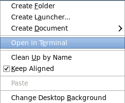

# Lab 300 - SOA composite applications Deployment from Oracle JDeveloper

---

## Introduction

This is the third and final lab that is part of the **SOACS** workshop. 

In this lab, you will deploy the **`ValidatePayment`** composite from JDeveloper directly to SOACS and test it.

## Objectives

- Learn how to create deploy SOA composites from JDeveloper to SOACS

## Required Artifacts

- The following lab and the **ValidatePayment** composite configured in the previous lab.

## Pre-requisites

After provisioning the SOA Cloud Service instance, there are a few post-provisioning steps that
are required for deployment from JDeveloper to be successful.

**Create a host entry in your environment**

- Open a terminal by Right click and **Open in Terminal**.

    

- Enter ***su*** and enter Password as **oracle** when prompted.

- Open the hosts file. Enter the **etc** folder by typing **cd /root/** followed by **cd /etc**. Enter **vi hosts**.

    

- Add the **IP** and **Hostname** into the host file. Hit **Esc** on the keyboard and press **`i`** to edit. Add the entry, hit **Esc** followed by **`:wq`** and hit **Enter**.

    

- Verify the entry by typing **cat hosts**.

    

## High-Level Steps

-   Deploy the ValidatePayment Composite from JDeveloper

-	Test the project from EM console

## Steps in Detail

### Deploy the ValidatePayment Composite from JDeveloper

-   Right-click on the project name in the project menu - select **Deploy** and your **project name**. Make sure you have the project menu and not the application menu in order to see this option.

    

-	Select the first option **Deploy to Application Server**.

    

-	Click **Next**.

-	For our labs, we will deploy with Revision ID 1.0.
Select the checkboxes for **Mark composite revision as default** and **Overwrite any existing composites with the same revision ID**.

    

-   Click **Next**.

-   Click on the **`+`** icon to add our SOACS cloud instance.

    

-   Enter the connection name as **SOACS**.

    

-   Click **Next**.

-   Enter the server Username and Password.

    

-   Click **Next**.

-   Enter the **Hostname**, leave the ports as default, make sure the **Always use SSL** checkbox is selected. Enter the **WebLogic Domain** name.

    

-   Click **Next**.

-   Click on **Test Connection**.

    

-   Click **Accept This Session** when the certificate details popup.

    

-   Make sure all the 12 tests are successful.

    

-   Click **Next**.

-   View the summary of the connection and click **Finish**.

    

-   Select the newly created connection **SOACS**, make sure the **Overwrite modules of the same name** is checked.

    

-   Click **Next**.

-   Verify that the SOA servers are shown and selected.

    

-   Click **Next**.

-   Verify the deployment summary and click **Finish**.

    

-   Check the deployment logs and verify that the composite has been successfully deployed to SOACS.

    

### Test the project from EM console

**Refer to Lab 200 to test the deployed SOA composite from the Oracle EM FMWC.**

You have now successfully completed all the labs of the SOACS Developer Workshop.
